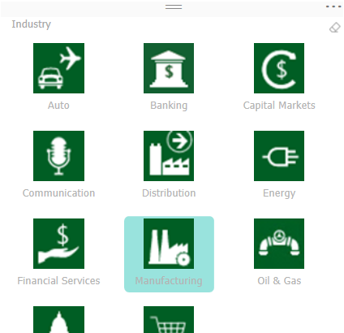

# PowerBI-visuals-ChicletSlicer
> Use this slicer to display image and/or text buttons that act as an in-canvas filter. Define additional properties for the layout & selection to customize this slicer to meet your specific needs

# Overview

The Chiclet Slicer was inspired by the great slicer control found in Excel since 2010, but with much greater customization options.
Chiclet are a slicers made of buttons, that can also be arranged horizontally for a very efficient real estate use, or arranged as a matrix for a super compact form.
Chiclet slicer also supports cross highlighting.
That's not all - they can even contain images!

See also [Chiclet Slicer at Microsoft Office store](https://store.office.com/en-us/app.aspx?assetid=WA104380756&sourcecorrid=1094fb73-f014-4f7a-accf-65142c8316af&searchapppos=0&ui=en-US&rs=en-US&ad=US&appredirect=false)

ChicletSlicer has 3 bucket fields: Category, Values and Images.
1. Category - Field with a list of categories for each "chiclet" item. String values
2. Values - Field with values for Category field. This field use just for cross filtering with other visuals.
3. Image - Field with a list of images for each "chiclet" item. Values of this field can be presented in "base64 image" format or it can be just external link to image.

# Selection
You can select any chiclet item for data filtering and also you can use multi selection. For cleaning of selection you should click to "Сlear" button on the right top corner of a visual.

# Search
You can filter a list of chiclets items by category using string search. For activation of search field you should click to "search" in options of the visual. After that you can input search string and data will be filtered immediately.

# Settings of ChicletSlicer
### General options
- Orientation: An order of "chiclets" list building. Can be vertical or horizontal
- Columns: Amount of ChicletSlicer columns.
- Rows: Amount of ChicletSlicer rows.
- Show disabled: Setting which regulate where will be displayed disabled chiclets items.
  This setting has 3 selection values:
  - Inplace: Disabled chiclets will be located in a their original positions.
  - Bottom: Disabled chiclets will be located in a bottom of the list.
  - Hide: Disabled chiclets will be hide from list.
- Multiple selection:
  - If this option is turned on you will be able to select chiclets without Ctrl button. (It will be usefull for multiple selection on mobile devices)
  - If this option is turned off you have to use Ctrl button for multiple selection.
- Forced selection: This setting forcibly select first item and doesn't allow to unselect any chiclet item

### Chiclets options
- Text size: Size of text for chiclet item.
- Height: Height of chicklet item.
- Width: Width of chiclet item.
- Background: Background color of all ChicletSlicer.
- Transparency: Transparency of ChicletSlicer background.
- Selected Color: Background color of selected chiclet item.
- Hover color: Text color when you hover to chiclet item.
- Unselected color: Background color of unselected chicklet items.
- Disabled color: Color of disabled chicklet item.
- Outline color: Color for outline of chiclet item.
- Outline weight: Thickness of chiclet item outline.
- Text color: Color of chiclet item text.
- Padding: Indent around chiclet item.
- Outline style: Style of outline.
  This settins has 3 selection values:
  - Rounded: Round outline edges
  - Cut: Semicircular outline edges
  - Square: Square outline edges

### Images options
- Image split: Height of Image for chiclet item
- Round: Shows image as rounded
- Stretch image: Stretch image to full chiclet item width
- Bottom image:
  - If this option is turned on image will be in the bottom of chiclet item, under the text
  - If this option is turned off image will be in the top of chiclet item, above the text